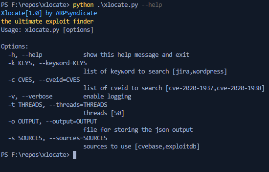

# Xlocate | The ultimate exploit finder

## Screenshots

## Instructions for running
1. Run `python3 xlocate.py -h`.  

**COMPATIBILITY TESTED ON ARCHLINUX(x64), DEBIAN(x64) & WINDOWS10(x64) ONLY** 
**FEEL FREE TO SUBMIT PULL REQUESTS**
